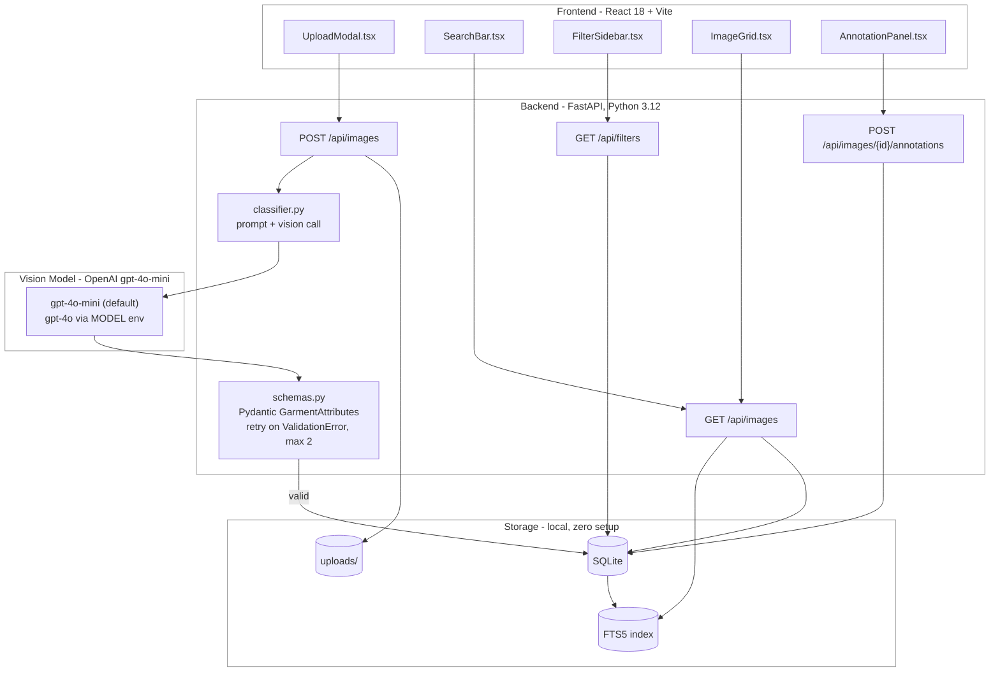
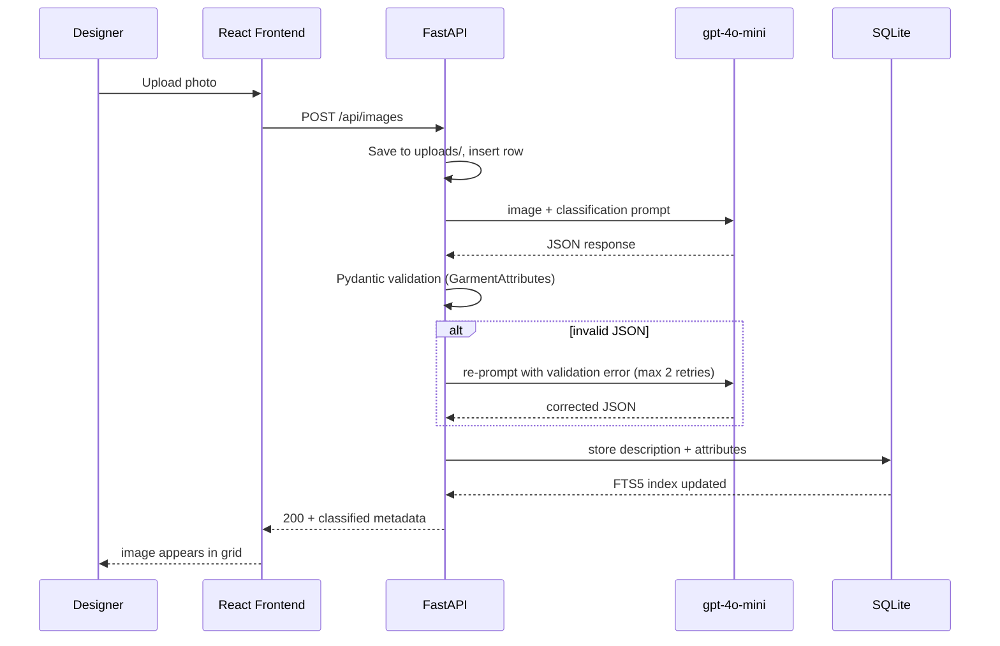

# Design Doc: Fashion Garment Classification & Inspiration Web App

## 1. Problem

Design teams collect thousands of inspiration photos across stores, markets, and street fashion. Scattered across phones and shared folders, these images are impossible to search, compare, or build on. This app turns that image library into a searchable, filterable, annotatable source of inspiration.

Core workflow: upload a garment photo, an AI model classifies it into rich structured attributes plus a natural language description, then designers search, filter, and annotate the library.

## 2. Architecture



The core design principle: **all intelligence happens once, at upload time.** The vision model converts pixels into a rich description and structured attributes. Everything downstream (search, filters, annotations) is ordinary CRUD over structured data. No model calls at query time, so reads are fast and free.

### Upload and classification sequence



## 3. Classification Approach

The "classifier" is a single vision LLM call with a strict output contract:

```
image + prompt -> vision LLM -> JSON -> Pydantic validation -> DB
```

No trained model. A frontier vision model zero-shot outperforms anything trainable in this timebox, covers open-ended attributes (style, trend notes, occasion) that no off-the-shelf classifier handles, and produces the required natural language description in the same call.

### Output schema

Closed vocabularies (enums) where evaluation needs exact matching; free text where richness matters more than measurability.

```python
class GarmentAttributes(BaseModel):
    description: str                      # rich natural language, FTS-indexed
    garment_type: GarmentType             # enum: dress, jacket, trousers, ...
    style: str                            # free text: "bohemian", "streetwear"
    material: str                         # free text: "denim", "linen blend"
    color_palette: list[str]              # ["indigo", "cream"]
    pattern: str                          # "floral print", "solid"
    season: Season                        # enum: spring, summer, fall, winter, all_season
    occasion: Occasion                    # enum: casual, formal, business, athletic, evening, festival
    consumer_profile: str                 # free text
    trend_notes: str                      # free text
    location_context: LocationContext     # continent/country/city, each Optional
```

Design choice: enums for `garment_type`, `season`, `occasion` make per-attribute accuracy measurable without fuzzy matching. Free text for `style` and `material` preserves descriptive richness. `location_context` fields are Optional and the prompt explicitly instructs the model to return null rather than guess. A model that confabulates "Italy" from a white studio backdrop is worse than one that says unknown.

### Parsing and retries

Model output is validated against the Pydantic schema. On `ValidationError`, the error message is appended to a re-prompt and the call retried (max 2). After exhausting retries, the image is stored with `status: failed` and surfaced in the UI for manual re-classification. Parsing handles markdown fences and leading/trailing prose defensively.

### Model choice

Default is `gpt-4o-mini`, switchable to `gpt-4o` via the `MODEL` env var. Garment attribute extraction is a perception task, not a reasoning task, and is largely saturated for small multimodal models. At the product's real scale (thousands of field photos per team), per-image cost and latency dominate operating cost. The eval (section 6) measures the actual quality delta between the two models rather than assuming the flagship is necessary.

## 4. Data Model

```sql
images (
    id INTEGER PRIMARY KEY,
    filename TEXT NOT NULL,
    uploaded_at TEXT NOT NULL,          -- ISO 8601
    designer TEXT,
    status TEXT NOT NULL,               -- processing | classified | failed
    description TEXT,                   -- AI natural language output
    attributes JSON,                    -- full GarmentAttributes payload
    garment_type TEXT, season TEXT, occasion TEXT,   -- promoted columns for fast filtering
    continent TEXT, country TEXT, city TEXT,
    year INTEGER, month INTEGER
)

annotations (
    id INTEGER PRIMARY KEY,
    image_id INTEGER REFERENCES images(id),
    kind TEXT NOT NULL,                 -- tag | note
    content TEXT NOT NULL,
    created_at TEXT NOT NULL
    -- source is implicitly "designer"; AI output lives only in images
)

images_fts (FTS5 virtual table over description + annotation content)
```

Frequently filtered attributes are promoted to real columns; the full payload is kept as JSON for flexibility. Annotations live in a separate table, which keeps AI output and human input structurally distinct (a spec requirement) rather than relying on a flag.

## 5. Search and Filtering

- **Attribute filters:** SQL WHERE over promoted columns. Filter options are generated at request time from `SELECT DISTINCT` over the actual data (`GET /api/filters`), never hardcoded. New attribute values appear as filter options automatically.
- **Contextual filters:** location (continent/country/city), time (year/month/season), designer. Same mechanism.
- **Full-text search:** FTS5 over descriptions and annotations handles queries like "embroidered neckline" or "artisan market". Lexical search is sufficient because the LLM already did the semantic work at upload time, converting visual content into searchable text.
- **Why no vector DB:** both retrieval modes here are exact-match filtering and keyword search. Embeddings earn their complexity for similarity queries ("find looks like this one"), which is the natural v2 (see section 8) but out of PoC scope. Adding one now would be infrastructure without a requirement.

## 6. Evaluation Methodology

Test set: ~70 images from two sources, unified under one labeling schema in `eval/test_set/labels.json`:

| Source | Count | Labels |
|---|---|---|
| Pexels API (street fashion, in-the-wild) | ~45 | fully hand-labeled |
| Kaggle Fashion Product Images (studio) | ~25 | pre-labeled (type, color, season, occasion), gaps filled manually |

Each image is tagged `source: street | studio`, giving two natural difficulty tiers.

Matching rules, per attribute class:
- Enum fields (garment_type, season, occasion): exact match
- Free-text fields (style, material): normalized synonym match (e.g. "denim" matches "jean")
- location_context: correct if predicted region matches label, or if model returns null when label is unknown

`eval/run_eval.py` runs the classifier over the set and writes a per-attribute accuracy table to `eval/results.md`, split by source tier, for both gpt-4o-mini and gpt-4o.

### Results summary

> TODO after eval run: per-attribute table, street vs studio split, mini vs flagship delta.

### Analysis

> TODO after eval run. Expected shape: strong on visually grounded attributes (garment type, color), weaker on material (texture from photos is hard) and location (insufficient signal in pixels; the real fix is EXIF or user-supplied location at upload, not a better prompt).

## 7. Trade-offs and Simplifying Assumptions

| Decision | Alternative | Why |
|---|---|---|
| Single LLM call per image | Multi-agent pipeline (LangGraph etc.) | No branching, no tool use, no iterative refinement in this task. A graph adds latency, cost, and failure surface for identical output. I build LangGraph systems in production; this does not meet the bar for one. |
| SQLite + FTS5 | Postgres, vector DB | Zero-setup local run is an explicit requirement. Retrieval here is exact-match + lexical; embeddings solve a problem this spec does not have. |
| Synchronous classification on upload | Job queue + polling | Acceptable at PoC scale (single user, one image at a time). Documented limitation; queue is the first thing to add for batch upload. |
| gpt-4o-mini default | Flagship model | Perception task, largely saturated for small models. Eval measures the delta instead of assuming. |
| Local file storage | S3 | PoC scope. Path abstraction in code makes the swap mechanical. |

## 8. Limitations and Next Steps

- **Batch upload + async queue:** current sync flow blocks per image.
- **Embedding-based similarity:** "find looks like this" via CLIP image embeddings, and semantic text search for queries like "bohemian summer vibes" that share no keywords with descriptions. This is where a vector index becomes justified.
- **Confidence scores in schema:** let the UI flag low-confidence attributes for designer correction, closing a human-in-the-loop loop with the annotation feature.
- **Attribute-specific prompting:** follow-up prompts for weak attributes (material) if eval confirms the gap.
- **Auth and multi-tenancy:** out of scope; designer identity is a free-text field.
